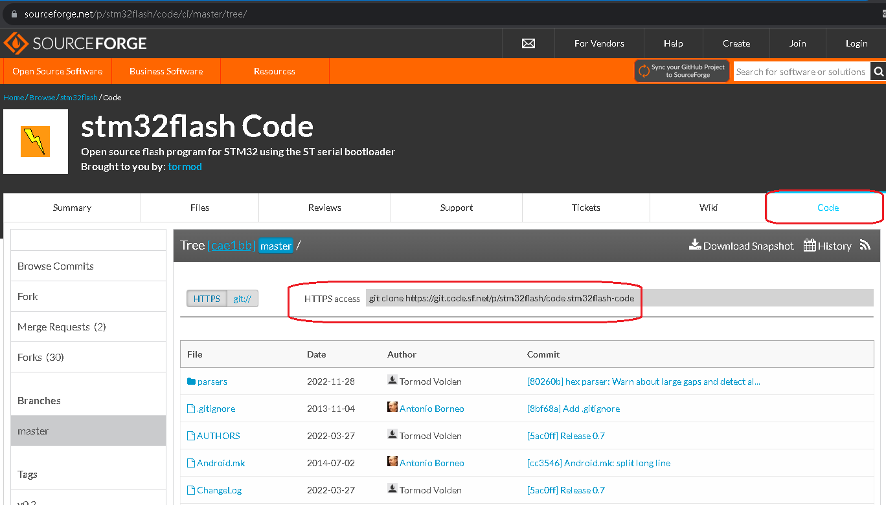
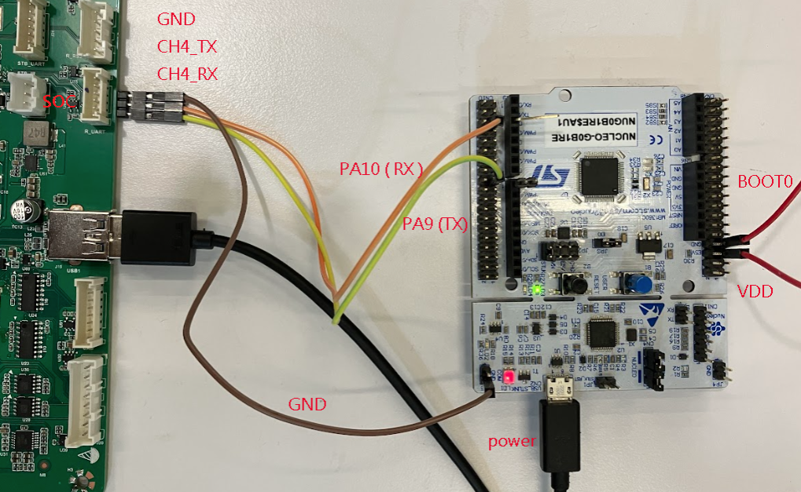
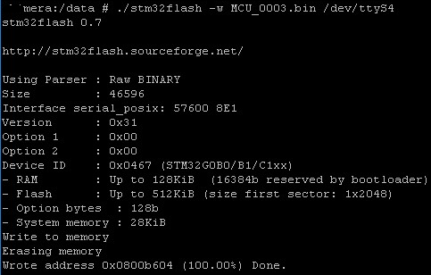

## build stm32flash on android
1. go your android code `cd external`  
2. clone from [link](https://sourceforge.net/p/stm32flash/code/ci/master/tree/)  
     
3. clone code `git clone https://git.code.sf.net/p/stm32flash/code stm32flash-code`  
4. Add `androidconfigure` that export path of compiler   
   ```#!/bin/bash
   set -e
   set -x
   if [ ! -d "$NDK" ]; then
     echo 'Please set $NDK to the path to NDK'
     exit 1
   fi
   cd $(dirname "$0")
   function RunConfigure() {
     HOST=$1
     TARGET=$2
     ARCH=$3
     TOOLCHAIN=${NDK}/toolchains/llvm/prebuilt/linux-x86_64/bin/
     export AR=${TOOLCHAIN}${HOST}-ar
     export AS=${TOOLCHAIN}${TARGET}-clang
     export CC=${TOOLCHAIN}${TARGET}-clang
     export CXX=${TOOLCHAIN}${TARGET}-clang++
     export LD=${TOOLCHAIN}${HOST}-ld
     export STRIP=${TOOLCHAIN}${HOST}-strip
     # Tell configure what flags Android requires.
     export CFLAGS="-fPIE -fPIC"
     export LDFLAGS="-pie"
   }
   RunConfigure "aarch64-linux-android" "aarch64-linux-android28" "arm64"```  

5. source env and build  
   ```
   source build/envsetup.sh
   mmm external/stm32flash-code
   ```  

6. adb push stm32flash and mcu app bin to android  
   ```
   adb root
   adb push out/target/product/xxx/system/bin/stm32flash /data
   
   adb push MCU_0003.bin /data
   ```  
   
7. connect BOOT0 and VDD -> power on stm32  
     

8. update stm32  
     

9. power off stm32 -> disconnect BOOT0 and VDD  -> power on stm32  

